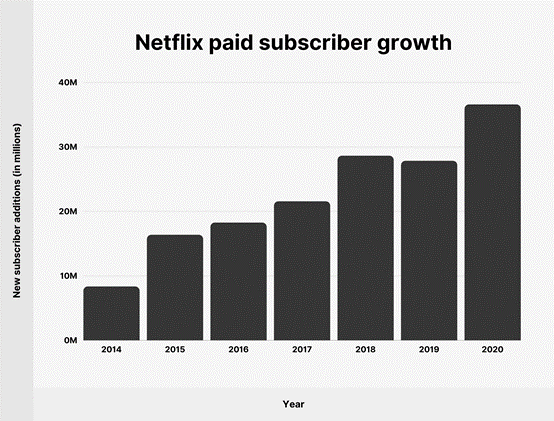

### [ Practice Module ] IRS-PM-2021-09-01-IS02PT-GRP-HFGL-A Movie Recommender System with implicit feedback.zip

---

### <<<<<<<<<<<<<<<<<<<< Start of Project >>>>>>>>>>>>>>>>>>>>

---

## SECTION 1 : PROJECT TITLE
## **A Movie Recommender System with implicit feedback**

---

## SECTION 2 : EXECUTIVE SUMMARY / PAPER ABSTRACT

The development of recommender system has passed nearly 20 years. Recommender System in general can be considered as a system which recommend items to users, the items includes goods, songs, movies, activities and so on. With time passing, users have realized that recommender system has eroded in every part of their life, especially in the digital era. They are more eager to be accurately recommended when they pick up a phone and click into the online shopping website. 

Besides purchasing goods from the internet, people’s inner world are waited to be satisfy. For the Covid-19 environment globally, the time people stay at home is increasing sharply. They tend to click into some websites, like YouTube, Netflix, Douban, or so on, to watch movies and episodes based on their past taste, which means accurate movie recommendation system meets people’s requirements.

Personalized services can build a bridge between users and merchants. When users use the website more frequently, the system can recommend suitable items to users to meet their demands. A good recommender system can attract more consumers and build a long-term relationship between each other in order to keep consumers from skipping into other websites. Of the multiply personalized recommendation algorithm, collaborative filtering is widely used, which is considered as the most successful recommendation algorithm. Our project mainly focus on using the one-class collaborative filtering to achieve better performance, which will be illustrated in detail below. We will take movie recommendation as an example, in order to make the whole designment more intuitively.

---

## SECTION 3 : CREDITS / PROJECT CONTRIBUTION

| Official Full Name  | Student ID (MTech Applicable)  | Work Items (Who Did What) |
| :------------ |:---------------:| :-----|
| Ni Yongxin | A0231559B | algorithm designer             |
| Zheng Zhiwei | A0231437L | feedback interface designer |
| Peng Junhao | A0231329L | interaction interface designer |

---

## SECTION 4 : VIDEO OF SYSTEM MODELLING & USE CASE DEMO

Note: It is not mandatory for every project member to appear in video presentation; Presentation by one project member is acceptable. 
More reference video presentations [here](https://www.youtube.com/watch?v=K7fLTOhfz8o&t=52s "video presentations")

---

## SECTION 5 : USER GUIDE

`Refer to project report at Github Folder: IRS_PROJECT/IRS_PROJECT/IRS project report.pdf`

### [ 1 ] interaction interface

> Type the URL http://junhao.io:8096/ and we can see the front interface shown like this. 
>
> Then log in with the id and password that we have registered already. Like the id ‘iss2021’ and password ‘Aa123456!’ we used in the video and then we can see the interface below.
>
> We can click in whatever movies or episodes we like and start to play.
>
> To use movie database and interaction interface, please refer to Appendix A User Guide;
> User should log in to access all the movie database and query the database with sql language, account username and password are provided in the appendix;
> You may use Report and Statistics function to access more related data such as favorite movie of each user and their watching records, or just use api key to further exploration;
> For personal privacy considerations, the api key and the code of accessing user's data is currently not provided in our github.
> The "data_convert.py" is used to convert the interaction records into the form that matches the input of the algorithm.

### [ 2 ] run the algorithm
> Click the ".bat" file, the algorithm would run and record the predict results in "result/metrics.txt" and "result/predict";
> "metrics.txt" reports the overall performance of the algorithm on the given dataset;
> "predict" records the predicted (user, item) pairs.

---
### [ 3 ] feedback interface

> The "web_crawler.py" is used to collect and storage the movie posters from the web;
> The "view.py" is used to display (i) user's historical items in train data, (ii) predicted items and (iii) items in test data,
> which are collect from the train file, the generated prediction file and the test file respectively. It's supported by a light
> game engine and is designed for display the feedback interface for users.

## SECTION 6 : PROJECT REPORT / PAPER

`Refer to project report at Github Folder: ProjectReport`

**Recommended Sections for Project Report / Paper:**
- Business requirements
- Business value
- System Structure
- Advantages of Our System
- Movie Database Construction and Interface Visualization
-  Evaluation
- User-friendly interface designment

---

### <<<<<<<<<<<<<<<<<<<< End of Project >>>>>>>>>>>>>>>>>>>>

---

